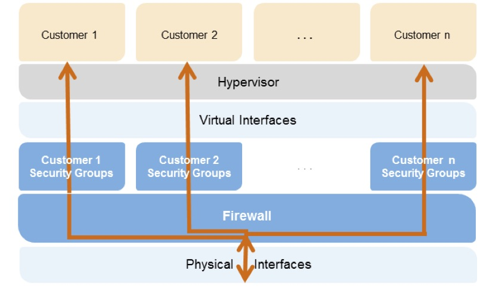

#  Infrastructure Security

## KMS Part 1

AWS Key Management Service - need to know this inside and out to pass the exam.

AWS KMS is a managed service that makes it easy for you to create and control the encryption keys used to encrypt your data, and uses HSMs to protec the security of your keys.

AWS KMS - sites on multitenant hardware.

KMS - console > IAM > Encryption keys

* IAM - global, encryption keys are regional

Scenario: CFO, creating financial reports, store in an s3 bucket only they should have access to.

* Create users - sys admin, financial controller (CFO), accounts team member
* Create two groups - administrators (AdministratorAccess) and finance (S3FullAccess,  ConsoleReadOnlyAccess)
* Create an encryption key for the CFO only - key material from KMS
    * Tag key - finance, owner
    * Key admin permissions - CFO (note you can grant to roles too), allow key administrators to delete the key
    * Permissions - grant to the CFO only
* Create a bucket
* Log in as the CFO
    * Upload - pick a couple files to s3 (pay slip, ether wallet, ether wallet json)
    * Next - under encryption, KMS key under ecryption (bucket in same region as key)
    * Upload
    * Make pay slip public - can't get it because don't have key
    * Change to AES 256 aws enncrypted - can now view public
    * CFO can open/view
* Log in as accounts team member (no access to key)
    * Can see key in IAM/KMS but can't edit/change anything
    * Go to the s3 bucket
        * Can see the public payslip (AWS key)
        * Can't view or open the other docs (public facing or through console), can't download it either.
* Log in ad admin (full administrator access) - to be continued in part 2

Key Policy - administer, use, delete

## KMS Part 2

Scenario, continued

* Log in as administrator (full administrator access)
* Can't access file via link - no key access, but... can open it, and download it (and it is encrypted)
* Can also become the key administrator, key owner, key user, etc.
* What if we downgrade the admin to SystemAdministrator?
  * Try to add yourself as administrator or user? Can't add users, just roles.
  * Go to s3 - click link, no access (like before), open or download - no access.

  What is the CFO leaves and deletes the encryption key?

  * Log in as CFO, delete the key
  * Can only disable, and schedule key deletion
  * Minimum 7 day delay to delete the key
  * Log in as root account owner/admin
    * Go to s3 - no link access, no download, no open

  Be careful who gets full AdministratorAccess and use CloudTrail to monitor key activity

## KMS Part 3 - Use your own key material

Create a new key
    
* Advanced options - external key material origin

Have to download wrapping key and import token before you can upload your key material

Use the 'sha1' version for this example.

Download openssl

Follow instructions in [the AWS documenation](https://docs.aws.amazon.com/kms/latest/developerguide/importing-keys-encrypt-key-material.html)

Import the key material - now you can use your key.

What happens if you create another key using the same key material?

* Use same encrypted key material, same import token
* Gives an error - import token already used, so download wrapping key
* Do it again... invalid cypher text - material encrypted using different wrapping key.
* Can't do this!

Cannot enable automatic key rotation when you provide your own key material.

*Ciphertexts are not portable between CMKs* - encrypt data under a KMS CMK, cipher text cannot be decrypted with another CMK.

You can delete the key material right away.

## KMS Part 4 - Summary

* Must know KMS in depth to pass the exam
* Know what services it is integrated with

Customer Master Key - two types: AWS and customer managed

CMK - Customer Master Key

* Alias, creation date, description, key state (enabled, disabled, waiting for import of key material, scheduled for deletion, etc), key material
* Can NEVER be exported
* AWS-managed CMK for each service that is integrated with AWS KMS, or you can have a customer-managed CMK you generate by providing AWS with key material.

Set up a CMK:

* Create alias and description
* Choose key material option
* Define key administrative permissions
  * IAM users/roles that can administer (but not use) the key through the KMS API
* Define key usage permissions
  * IAM users/roles that can use the key to encrypt and decryt data

Key material

* You can import a symmetric 256-bit key from your key management infrastructure into KMS and use it like and other customer master key.
* AWS can create the key material.

Why provide your own key material:

* Prove that randomness meets your requirements (compliance)
* Extend your existing processes to AWS
* To be able to delete key material without a 7 - 30 day wait. Then be able to import them again.
* To be resilient to AWS failure by storing keys outside AWS

Key Material Import

* Create CMK with no key material
* Download a public key (wrapping key) and import token
* Encrypt the key material
* Import the key material into KMS

Considerations for imported key material

* Availability and durability is different - you need to make the key material safe.
* Secure key generation is up to you
* No automatic rotation
* Ciphertexts are not portable between CMKs

Monitor key activity using cloud trail plus events and alerts, or AWS config with alerts

READ THE KMS FAQs

## EC2 and Customer Managed Key Pairs - Mac Users

* Download open ssl
* openssl genpkey -algorithm RSA -output private_key.pem -pkeyopt rsa_keygen_bits:2048
* openssl rsa -pubout -in private_key.pem -out public_key.pem
* chmod 400 private_key.pem
* AWS console > services > ec2
* Import key pair (remove the mime BEGIN PUBLIC KEY and END PUBLIC KEY lines)
* Now provision you instance, select the key pair you've uploaded via the public key import
* ssh in using your private_key.pem
* can't just import a public key into KMS - KMS is for symmetric encryption only

## Using KMS with EBS

Need to understand where you use KMS vs CloudHSM

Lab

* Remember: KMS keys are for a specific region
* Create a key with KMS key material
  * Grant admin, usage permissions - can assign to an admin
* Provision a new ec2 instance, e.g.g AWS linux, t2 micro, defaults
  * Add a new EBS volume, check encrypted
* Launch the instance
 * Modify volume - can change volume size and type, no encrypton
 * Same with snapshot - cannot change the encryption
 * Can't delete the managed key
* Stop the ec2 instance
  * Detach the root device volume
  * Modify volume - can't add encryption
  * Create a snapshot of thr root device volume
* Go to snapshots
  * Create an AMI from the snapshot
* On the image, modify image permissions
  * Can share with the world, or another account
* Image, actions, copy the AMI, selecting 'encrypt target ECS snapshots'
    * Select your CMK
    * Copying to another region, use key in the destination region

## EC2 and Key Pairs

Lab

* Log into console, launch an instance, defaults, launch it with a key pair you have access to (which you will delete later)
* ssh into the instance
* from ec2-user, go into .ssh and you see authorized_keys, which will contain your public key
* you can also curl http://169.254.169.254/latest/meta-data/
* we want http://169.254.169.254/latest/meta-data/public-keys/0/openssh-key/
* go to aws console, iam, create a new role (ec2), allow it to services on your behalf, pick S3AdminAccess.
* instance > settings > attach/replace iam role - add the role we created
* can now do aws s3 ls
* make a bucket via aws s3 mb
* ssh-keygen -t rsa - new key pair, not password protected
* add new public key to authorized keys
* cat mynewkp.pub >> ~/.ssh/authorized_keys
* chmod 400 mynewkp, copy it to our s3 bucket so we can download it
* on your laptop, download the private key, ssh in with the new key

## EC2 and Key Pairs part 2

* go to key pairs, delete the original key pair you deleted
* delete in the console, you can still log into ec2 instances that were launch with the keypair
* look at the instance metadata again using curl - public is still in the metadata
* how to add a new public key
  * actions > create image
  * launch the clone... create a new key pair as part of the launch... there you go
    * ssh in with the new key
    * look authorized keys - new key has been appended, previous ones are still there

SO... lost your key? SNapshot it creating a new AMI, relauch with the new AMI with a new keypair

Exam Tips

* Two ways to view the public key (file, meta-data)
* You can have multiple public keys (and users too)
* You can add roles to existing ec2 instances
* Deleting a keypair from the console does not delete it from instances
* Lose key - snapshot, relaunch, clean up keys
* You cannot use KMS with ssh for ec2
* You can use CLoudHSM keys with ec2

## AWS Marketplace Security Products

In the console, go to EC2, then launch an instance...

* Click on AWS Marketplace
* Scroll down to categories, select security
  * Firewalls, Hardened OS's, WAFs, Antivirus, Security Monitoring, etc.
* Exam - know that you can buy preconfigured AMIs
  * Scenario based questions - getting hacked, pick an AMI to mitigate the attack
  * If you can use a product and it saves you a lot of time, and there's a solution you can buy, that's probably the right answer if it handles everything for you.
* Check out the Center for Internet Security red hat enterprise linux AMI
 * Details has links to the benchmarks

## AWS WAF and AWS Shield

What is WAF

* A web application firewall that lets you monitor the HTTP and HTTPS requests that are forwarded to CloudFront or an appication load balancer. AWS WAF also lets you control access to your content.
* You can configure conditions such as allowed IPAddresses or required query string parameters to allow cloud front or the ALB to make an access decision.

At the most basic level, AWS WAF allows 3 different behaviors:

* Allow all requests except the ones you specify
* Block all requests except the ones you specify
* Count the requests that match the properties you specify

What it protects you against? Protection against web attacks using conditions you specify. You can define conditions using various characteristics of web requests:

* IP addresses the requests originate from (IP v4 and  v6 supported)
* Country the requests originate from
* Values in the request headers
* Strings that appear in requests (specific or regex match)
* Length of requests
* Presense of SQL code that is likely to be malicious (SQL injection)
* Presense of a script that is likely to be malicious (cross site scripting)

Application Load Balancers integrate with WAF at the regional level, CloudFront at the global level.

You need to associate your rules to AWS resources in order for it to work.

You can use WAF to protect website note hosted in AWS via CloudFront, which supports custom origins outside of AWS.

WAF - layer 7

AWS Shield

* Standard or advanced plan - go to the console and the shield page to see the differences
* Enterprise - $3000 a month
 * Incident response team, in depth reporting, no bill for charges incurred via DDoS attack

Demo - cloud formation stack - common attacks.json from the class resources.

## EC2 Dedicated Instances vs Dedicated Hosts

See [here](https://aws.amazon.com/ec2/dedicated-hosts/)

Dedicated instances are EC2 instances that run in a VPC on hardware that's dedicted to a single customer.

* Physically isolated at the host hardware level from instances that belong to all other AWS accounts.
* May share hardware with other instances from the same AWS account that are not dedicated instances.

Like dedicated instances, dedicated hosts allow you to launch instances on physical servers that are dedicated for your use.

* An important difference is dedicated hosts gives you additional visibility and control over how instances are placed on a physical server, and you can consistently deploy your instances to the same physical server overtime.
* Dedicated hosts enable you to use existing server-bound software licensing and address corporate compliance and regulatory requirements.

Provisioning

* EC2 console, pick dedicated hosts, then allocate a host.
* Or, launch an instance, in launch details, selected dedicated option in Tenancy.

Exam Tips

* Both dedicated instances and dedicated hosts have dedicated hardware.
* Dedicated instances are charged by the instance, dedicated hosts are charged by the host.
* If you have specific regulatory requirements or licensing conditions, choose dedicated hosts.
* Dedicated instances may share the same hardware with other AWS instances from the same account that are not dedicated.
* Dedicated hosts give you much better visibility into things like sockets, cores, and host id.

## AWS Hypervisors, Isolation of AWS Resources abd AWS Firewalls

AWS Hypervisor

* A hypervisor or virtual machine monitor (VMM) is computer software, firmware, or hardware that creates and runs virtual machines. A computer on which a hypervisor runs one or more virtual machines is called a host machine, and each virtual machine is called a guest machine.

AWS Hypervisor

* EC2 currently runs on Xen hypervisors. Xen hypervisors can have guest operating systens running either as paravirtualization (PV) or using Hardware Virtual Machine (HVM).
* HVM guests are fully virtualized. The VMs on top of the hypervisors are not aware that they are sharing processing time with other VMs.
* PV is a lighter form of virtualization and used to be quicker.
* Amazon recommends HVM over PV. Note windows can only be HVM.

PV

* PV guests rely on the hypervisor to provide support for operations that normally require priviledged access. The guest OS has no elevated access to the CPU.
* The CPU provides four separate privilege modes, 0-3, called rings, with 0 the most priveleged and 3 the least.
* The host OS executes in ring 0, the guest OS runs in 1, and apps run in 3.

Isolation

From the AWS Security Overview whitepaper.

Hypervisor Access

* Admins with a business need to access the management plane are required to use MFA to gain access to purpose built admin hosts.
* Admin hosts are specifically designed, built, configured, and hardened to protect the management plane of the cloud.
* All access is logged and audited.
* When access is no longer needed, priveleges and access can be revoked.

Guest Access

* Completely controlled by the customer.
* AWS has no access.

Memory Scrubbing

* EBS automatically resets every block of storage used by the customer, so that one customer's data is never unintentionally exposed  to another.
* Memory allocated to guests is scrubbed by the hypervisor when it is unallocated to a guest. Memory is not returned to the pool available for new allocations until scrubbed.

Exam Tips

* Choose HVM or PV where possible.
* PV is isolated by layers, guest OS in layer 1, apps in layer 3.
* Only AWS admins have admin accces to hypervisors.
* AWS staff do not have access to EC2 - that is the responsibility of the customer.
* Storage and RAM are scubbed before it is delivered to you.

C5/Nitro - KVM based

## Section 5 Summary

KMS - see above