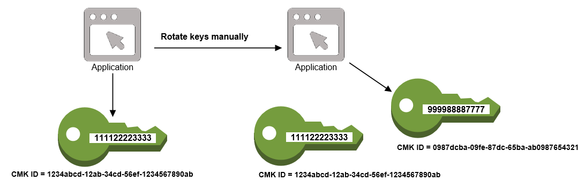

# AWS Key Management Service

> AWS KMS is a managed service that enables you to easily encrypt your data. AWS KMS provides a highly available key storage, management, and auditing solution for you to encrypt data within your own applications and control the encryption of stored data across AWS services.

## Key Import

* 256-bit symmetric keys
* Protected in transit by wrapping the key with an AWS KMS-provided public key using using one of two RSA PKCS #1 schemes.

If you import your own key material:

* You are responsible for maintaining a copy of your imported keys in your key management infrastructure so that you can re-import them at any time
* You may set an expiration period for an imported key. AWS KMS will automatically delete the key material after the expiration period. You may also delete imported key material on demand. In both cases the key material itself is deleted but the CMK reference in KMS and associated metadata are retained so that the key material can be re-imported in the future.
*  Automatic key rotation is not supported for imported keys or keys generated in an AWS CloudHSM cluster using the KMS custom key store feature. If you choose to import keys to AWS KMS or use a custom key store, you can manually rotate them whenever you want by creating a new CMK and mapping a key alias from the old key to the new key.
* If you manually rotate your imported or custom key store keys, you may have to re-encrypt your data depending on whether you decide to keep old versions of keys available.
* For customer master keys with imported key materials, you can delete the key material without deleting the key id or metadata.
* If your imported key material is expired or accidentally deleted, you can re-import your copy of the key material with a valid expiration period to AWS KMS under the original customer master key so it can be used.

## Key Rotation

### Automatic

When enabled (it can be enabled and disabled, disabled by default), AWS KMS generates new key material every 365 days, and saves the older key material such that it can be used to decrypt data that was encrypted with the older key material.

Key rotation only changes the CMK's backing key, it does not change the arn or other properties.

Not available for CMK's with imported key material.

### Manual

Manual key rotation involves creating a new CMK, then updating your apps to use it, or changing your key alias to point to the new CMK.

* Since the new key is different resource than the previous key, it has a different key id and arn. You need to update references to the old key to the new key in order to start using it. KMS keeps track of the master key used to encrypt data. 
* If you use a key alias in your application, you can point the alias to the new key and your application will then use the new key.

> When you begin using the new CMK, be sure to keep the original CMK enabled so that AWS KMS can decrypt data that the original CMK encrypted. When decrypting data, KMS identifies the CMK that was used to encrypt the data, and it uses the same CMK to decrypt the data. As long as you keep both the original and new CMKs enabled, AWS KMS can decrypt any data that was encrypted by either CMK.