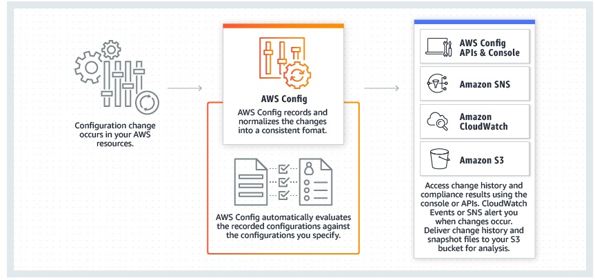

# Notes - Post Linux Academy Challenge


Topics

* Incident response plans - be clear on the goals of frequently testing and simulating incident response plans
* What do you do after creating a new account to avoid issues with root credentials?
    * IAM best practices describes [locking away root user keys](https://docs.aws.amazon.com/IAM/latest/UserGuide/best-practices.html#lock-away-credentials) - protect the password, use MFA, delete access keys, use strong password, etc
* Understand AWS Config and its before and after capabilities, including IAM permissions.
* Compromised EC2 instance - what to do?
* Keys in a public repo - what to do?
    * See [this blog post](https://aws.amazon.com/blogs/security/what-to-do-if-you-inadvertently-expose-an-aws-access-key/)
* Default encryption on s3 objects
* AWS Config Rules - check for things like logging enabled on all buckets
    * Two types - predefined and custom
* Review bucket policies, bucket ACLs, and use cases - including bucket policies for unauthenticated users.
    * See [this](https://aws.amazon.com/blogs/security/iam-policies-and-bucket-policies-and-acls-oh-my-controlling-access-to-s3-resources/) blog post.
* Review basic capabilities of security related services
* Create a private, isolated s3 bucket
* Enforce requirement that all objects upload to s3 use SSE-S3 using AWS_256
* Long term credentials for service accounts - IAM user
* KMS API operations include re-encrypt
* Key rotation details for KMS
* FIPS levels for KMS, CloudHSM
* CMK resource policy
* KMS throttling errors, encryption SDK key caching
* CloudHSM JCE compatibility
  * If you are developing your own custom application, your application can use the standard APIs supported by CloudHSM, including PKCS#11 and Java JCA/JCE (Java Cryptography Architecture/Java Cryptography Extensions). Support for Microsoft CAPI/CNG is coming soon.
  * 
* Know the distinction of CMKs and DEKs and what KMS can manage and generate.
* Inline vs Managed Policies - see [here]
(https://docs.aws.amazon.com/IAM/latest/UserGuide/access_policies_managed-vs-inline.html)
  > Inline policies are useful if you want to maintain a strict one-to-one relationship between a policy and the principal entity that it's applied to. For example, you want to be sure that the permissions in a policy are not inadvertently assigned to a principal entity other than the one they're intended for. When you use an inline policy, the permissions in the policy cannot be inadvertently attached to the wrong principal entity. In addition, when you use the AWS Management Console to delete that principal entity, the policies embedded in the principal entity are deleted as well. That's because they are part of the principal entity.
* Condition operators - see [here](https://docs.aws.amazon.com/IAM/latest/UserGuide/reference_policies_elements_condition_operators.html)
* Monitoring root user activity - CloudWatch events rules + lambda function - [here](https://aws.amazon.com/blogs/mt/monitor-and-notify-on-aws-account-root-user-activity/)
* CloudTrail logs - encrypted by default. See [here](https://docs.aws.amazon.com/awscloudtrail/latest/userguide/encrypting-cloudtrail-log-files-with-aws-kms.html)
* Legacy logs to CloudWatch - use the cloud watch agent.
* Console SSO - direct connect between the corp network and AWS region, IAM to establish trust relationship between IAM and the corp directory identity provider (IdP)


## Notes

### Policies

See [here](https://docs.aws.amazon.com/IAM/latest/UserGuide/introduction_access-management.html)

*Identity-based* policies control what actions the identity can perform, on what resources, and under what conditions. These are permissions policies you attach to an IAM identity such as a user, group, or role.

* Managed and inline variants.

*Resource-based policies* control what actions a specified principal can perform on that resource and under what conditions. These are permissions policies you attach to a resource such as an S3 bucket or an IAM role trust policy.

* Inline only
* To enable cross account access, you can specify an entire account or IAM entities in another account as the principal in a resource based policy.

> The IAM service supports only one type of resource-based policy called a role trust policy, which is attached to an IAM role. Because an IAM role is both an identity and a resource that supports resource-based policies, you must attach both a trust policy and an identity-based policy to an IAM role. Trust policies define which principal entities (accounts, users, roles, and federated users) can assume the role. 

Some services that support resource based policies

* S3 buckets
* SNS topics
* SQS queues

Delegating AWS Permissions in a Resource-based policy

* After a resource grants your AWS account permissions as a principal in its resource based policy, you can then delegate permissions to specific users or groups under your AWS accounts.
* You can delegate a subset of the original permissions granted, but not more.

### AWS Config - Before and After

* Continuously monitor and record configuration changes of AWS resources
* Send notifications if config has changed via SNS, can fire lambdas from that, etc.
* Review history of config states
* Combine with CloudTrail to identify root causes of operational problems
* Mutli-account, multi-region data aggregation




### S3 Encryption

Can use a policy to require server-side encryption:

```console
{
   "Version":"2012-10-17",
   "Id":"PutObjPolicy",
   "Statement":[{
         "Sid":"DenyUnEncryptedObjectUploads",
         "Effect":"Deny",
         "Principal":"*",
         "Action":"s3:PutObject",
         "Resource":"arn:aws:s3:::YourBucket/*",
         "Condition":{
            "StringNotEquals":{
               "s3:x-amz-server-side-encryption":"aws:kms"
            }
         }
      }
   ]
}
```

Can also use condition key of `s3:x-amz-server-side-encryption-aws-kms-key-id `

### Private, Isolated S3 Bucket

Use an VPC endpoint for amazon S3 - a vpc endpoint for s3 is a logical entity within a vpc that allows connectivity to s3. The vpc endpoint routes requests to s3 and and routes responses back to the vpc.

* You can control the requests, users, or groups that are allowed through a specific vpc endpoint.
* You can control which vpcs or vpc endpoints have access to your s3 bucket.

The following is an example of an S3 bucket policy that restricts access to a specific bucket, examplebucket, only from the VPC endpoint with the ID vpce-1a2b3c4d. 

```console
{
   "Version": "2012-10-17",
   "Id": "Policy1415115909152",
   "Statement": [
     {
       "Sid": "Access-to-specific-VPCE-only",
       "Principal": "*",
       "Action": "s3:*",
       "Effect": "Deny",
       "Resource": ["arn:aws:s3:::examplebucket",
                    "arn:aws:s3:::examplebucket/*"],
       "Condition": {
         "StringNotEquals": {
           "aws:sourceVpce": "vpce-1a2b3c4d"
         }
       }
     }
   ]
}
```
You can create a bucket policy that restricts access to a specific VPC by using the aws:sourceVpc condition. 

```console
{
   "Version": "2012-10-17",
   "Id": "Policy1415115909153",
   "Statement": [
     {
       "Sid": "Access-to-specific-VPC-only",
       "Principal": "*",
       "Action": "s3:*",
       "Effect": "Deny",
       "Resource": ["arn:aws:s3:::examplebucket",
                    "arn:aws:s3:::examplebucket/*"],
       "Condition": {
         "StringNotEquals": {
           "aws:sourceVpc": "vpc-111bbb22"
         }
       }
     }
   ]
}
```

### FIPS - Federal Information Processing Standard

Publication 140-2 

KMS - crypto module validated at Level 2 Overall

> AWS Key Management Service (KMS) is a multi-tenant, managed service that allows you to use and manage encryption keys. Both services offer a high level of security for your cryptographic keys. AWS CloudHSM provides a dedicated, FIPS 140-2 Level 3 HSM under your exclusive control, directly in your Amazon Virtual Private Cloud (VPC).

### Unmanageable CMKs

Example: CMK key policy allows only one IAM user to managed the key. If that user is deleted the key in unmanageable. AWS support must contacted to regain access to the CMK.

Note that you must grant access to the account (root) to allow it to enable IAM policies

```console
{
  "Sid": "Enable IAM User Permissions",
  "Effect": "Allow",
  "Principal": {"AWS": "arn:aws:iam::111122223333:root"},
  "Action": "kms:*",
  "Resource": "*"
}
```

Key administrators, Key users

### KMS API throttling

Encrypt, Decrypt, GenerateDataKey, GenerateDataKeyWithoutPlaintext, GenerateRandom, ReEncrypt have account limits of 5500 (some regions support 10000), shared.

### KMS Misc

* Primary resources are customer master keys
* Typical use is to generate, encrypt, and descrypt data keys
* Data keys - keys you can use to encrypt data, including large amounts of data and other encryption keys
  * AWS KMS does not store, manage, or track your data keys