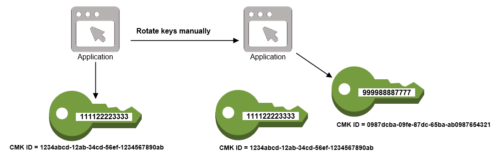

# Practice Exam Learnings

Some notes from taking the practive exam:

* Be clear on what the different services do, including Macie, Inspector, GuardDuty, Trusted Advisor and Systems Manager
* Know how key rotation work withs CMKs - both with standard key materials and imported key materials
* Know when ephemeral ports must be considered in security groups and NAT ACLs
* Understand S3 VPC endpoints and others as well
* Review VPNs
* Review service control policies
* Know how to set up and leverage cross account access for s3
* Know how the security token service is used

## Services

### Macie

> Amazon Macie is a security service that uses machine learning to automatically discover, classify, and protect sensitive data in AWS. Amazon Macie recognizes sensitive data such as personally identifiable information (PII) or intellectual property, and provides you with dashboards and alerts that give visibility into how this data is being accessed or moved. The fully managed service continuously monitors data access activity for anomalies, and generates detailed alerts when it detects risk of unauthorized access or inadvertent data leaks. Today, Amazon Macie is available to protect data stored in Amazon S3, with support for additional AWS data stores coming later this year.

### Inspector

> Amazon Inspector is an automated security assessment service that helps improve the security and compliance of applications deployed on AWS. Amazon Inspector automatically assesses applications for exposure, vulnerabilities, and deviations from best practices. After performing an assessment, Amazon Inspector produces a detailed list of security findings prioritized by level of severity. These findings can be reviewed directly or as part of detailed assessment reports which are available via the Amazon Inspector console or API.

> Amazon Inspector security assessments help you check for unintended network accessibility of your Amazon EC2 instances and for vulnerabilities on those EC2 instances. Amazon Inspector assessments are offered to you as pre-defined rules packages mapped to common security best practices and vulnerability definitions. Examples of built-in rules include checking for access to your EC2 instances from the internet, remote root login being enabled, or vulnerable software versions installed. These rules are regularly updated by AWS security researchers.

### GuardDuty

> Amazon GuardDuty is a threat detection service that continuously monitors for malicious or unauthorized behavior to help you protect your AWS accounts and workloads. It monitors for activity such as unusual API calls or potentially unauthorized deployments that indicate a possible account compromise. GuardDuty also detects potentially compromised instances or reconnaissance by attackers.

> Enabled with a few clicks in the AWS Management Console, Amazon GuardDuty can immediately begin analyzing billions of events across your AWS accounts for signs of risk. GuardDuty identifies suspected attackers through integrated threat intelligence feeds and uses machine learning to detect anomalies in account and workload activity. When a potential threat is detected, the service delivers a detailed security alert to the GuardDuty console and AWS CloudWatch Events. This makes alerts actionable and easy to integrate into existing event management and workflow systems.

> Amazon GuardDuty is cost effective and easy. It does not require you to deploy and maintain software or security infrastructure, meaning it can be enabled quickly with no risk of negatively impacting existing application workloads. There are no upfront costs with GuardDuty, no software to deploy, and no threat intelligence feeds required. Customers pay for the events analyzed by GuardDuty and there is a 30-day free trial available for every new account to the service.

### Trusted Advisor

> AWS Trusted Advisor acts like your customized cloud expert, and it helps you provision your resources by following best practices. Trusted Advisor inspects your AWS environment and finds opportunities to save money, improve system performance and reliability, or help close security gaps. Since 2013, customers have viewed over 2.6 million best-practice recommendations and realized over $350 million in estimated cost reductions.

> You can start with a free version of AWS Trusted Advisor in the AWS Management Console with two of the most popular performance and security recommendations, and access to these checks never expires. All of the AWS Trusted Advisor checks are available to customers with Business-level and Enterprise-level support. Why hire a cloud consultant? Start using AWS Trusted Advisor today!

### Systems Manager

> AWS Systems Manager gives you visibility and control of your infrastructure on AWS. Systems Manager provides a unified user interface so you can view operational data from multiple AWS services and allows you to automate operational tasks across your AWS resources. With Systems Manager, you can group resources, like Amazon EC2 instances, Amazon S3 buckets, or Amazon RDS instances, by application, view operational data for monitoring and troubleshooting, and take action on your groups of resources. Systems Manager simplifies resource and application management, shortens the time to detect and resolve operational problems, and makes it easy to operate and manage your infrastructure securely at scale.

## Key Rotation

### Automatic

When enabled (it can be enabled and disabled, disabled by default), AWS KMS generates new key material every 365 days, and saves the older key material such that it can be used to decrypt data that was encrypted with the older key material.

Key rotation only changes the CMK's backing key, it does not change the arn or other properties.

Not available for CMK's with imported key material.

### Manual

Manual key rotation involves creating a new CMK, then updating your apps to use it, or changing your key alias to point to the new CMK.

* Since the new key is different resource than the previous key, it has a different key id and arn. You need to update references to the old key to the new key in order to start using it. KMS keeps track of the master key used to encrypt data. 
* If you use a key alias in your application, you can point the alias to the new key and your application will then use the new key.

> When you begin using the new CMK, be sure to keep the original CMK enabled so that AWS KMS can decrypt data that the original CMK encrypted. When decrypting data, KMS identifies the CMK that was used to encrypt the data, and it uses the same CMK to decrypt the data. As long as you keep both the original and new CMKs enabled, AWS KMS can decrypt any data that was encrypted by either CMK.

## IAM

* IAM policy model - PARC - principal, action, resource, condition

Principal

* Sometimes implicit in the context (user, group, role)
* Everyone (anonymous users) `"Principal":"AWS":"*.*"`
* Specific account or accounts `"Principal":{"AWS":"aws:arn:iam::123456789012:root"}` or `"Principal":{       "AWS":"123456789012"}`
* Individual IAM user `"Principal":"AWS":"aws:arn:iam::123456789012:user/username"`
* Federated User `"Principal":{"Federated":"accounts.google.com"}`
* Specific role `"Principal":{"AWS":"aws:arn:iam::123456789012:role/rolename"}`
* Specific service: `"Principal":{"Service":"ec2.amazonaws.com"}`

Action or NotAction element

* NotAction is not a deny, it just excludes some things from the allow statement. Another policy could be attached that would allow or include the NotAction exclusions in the original policy

Policy Variables

Example: `${aws:userid}`

Some based on service request context:

* SourceIp, CurrentTime, etc.
* username, userid, principaltype
* graph.facebook.com:id, www.amazon.com:user_id
* saml:aud, saml:iss

See docs for service-specific vars

Policy with variables - must include the Version 2012-10-17 otherwise treated as literals

Policy Enforcement

[Permissions boundaries](https://aws.amazon.com/blogs/security/delegate-permission-management-to-developers-using-iam-permissions-boundaries/) - define the max set of operations, typically narrowed down to a subset. Boundary enforced via Condition that references the boundary via iam:PermissionBoundary

Cross Account Console Access

* Role referencing an access policy that grants allow for some actions
* Trust policy - specifies who can assume the role, assigned to the role

Trust policy can grant access to an entire account, an iam user, an assumed role (via sts), multiple, etc.

See [this](https://docs.aws.amazon.com/IAM/latest/UserGuide/tutorial_cross-account-with-roles.html) tutorial